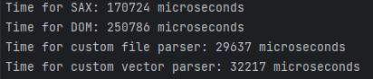

# Результаты замеров времени

**Вывод:** Как видно из результатов, обработка файла с помощью SAX работает быстрее, чем реализация DOM, загружающая все
в некоторую структуру. Однако наши кастомные реализации работают быстрее их обоих, что связанно с тем, что мы лишь читаем,
никуда не записываем.