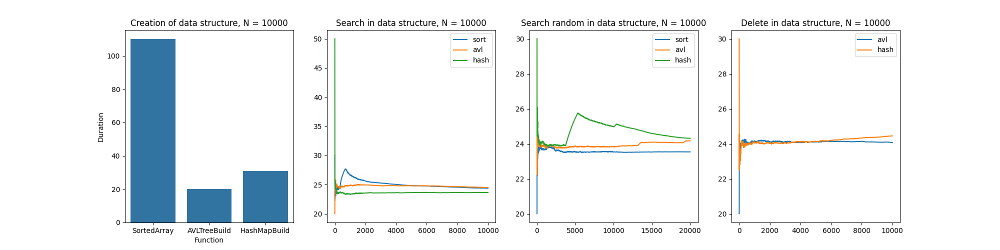
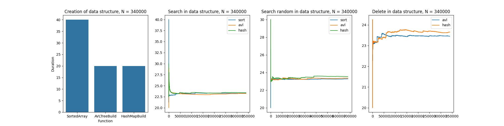
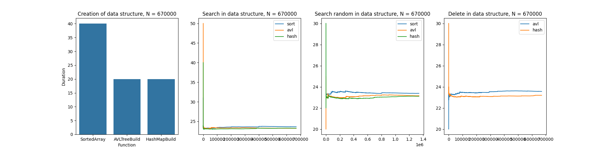
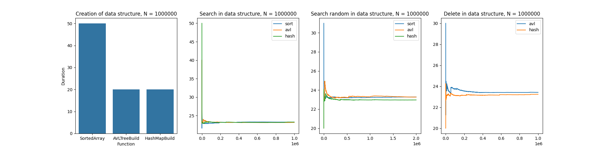

# Изучение скорости работы сортировки, AVL дерева и хэш-мапы
## Цель работы
Изучение скорости исполнения следующего алгоритма посредством сортировки, AVL-дерева и хэш-мапы:

Дано N объектов с двумя ключевыми полями каждый. Оба поля типа строка. Каждая пара уникальная. Длина полей от 7 до 20 символов. Набор используемых символов – русские и английские буквы верхнего и нижнего регистров и цифры.

1. Сформировать N случайных объектов
2. Организовать быстрый поиск объектов с помощью трех алгоритмов:
   - Отсортированный массив (метод деления пополам);
   - АВЛ-дерево;
   - Хеш-таблица.
3. Сравнить время работы полученных алгоритмов раздельно по трем этапам:
      - Размещение массива данных в структурах соответствующих алгоритму. Для отсортированного массива это сортировка, для дерева и хеш-таблицы – внесение данных по одному элементу;
      - Поиск. Сравнение времени поиска провести двумя способами:
      - Найти один раз все объекты из исходных данных;
      - Сгенерировать 2*N случайных объектов и произвести поиск их среди исходных данных. При сравнении время генерации случайных объектов не учитывать.
      - Освобождение ресурсов используемых алгоритмом, т.е. выполнение операции удаления массива, дерева или хеш-таблицы.
      - Удаление данных по одному элементу из хэш-таблицы и АВЛ-дерева.
4. Для алгоритмов АВЛ-дерево и Хеш-таблицы дополнительно следует сравнить время удаления данных по одному элементу.

## Результаты
Для каждого N построим графики по следующему принципу:
1. Гистограмма с временем создания каждой из структур.
2. Выборочное среднее времени поиска элемента от N, который уже есть в структуре.
3. Выборочное среднее времени поиска случайного элемента от N.
4. (Для AVL-дерева и хэш-мапы) Выборочное среднее времени удаления всех элементов.

