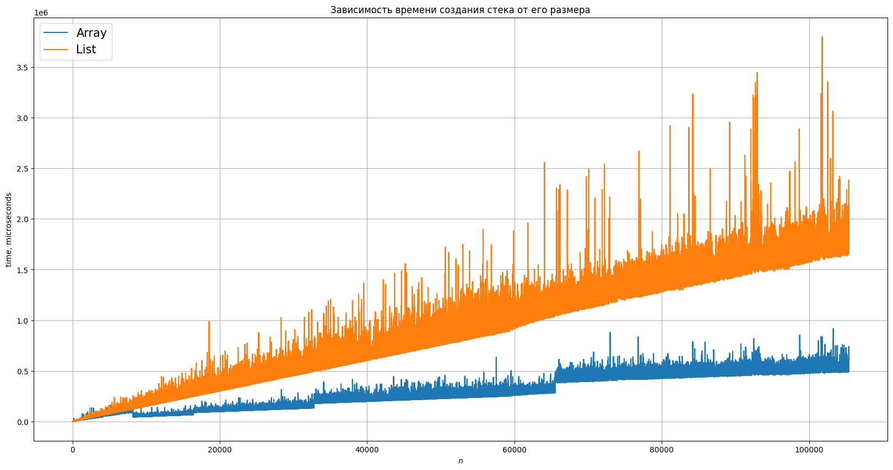

# Анализ работы стека

---
## Зависимость времени создания стека от его размера

Построим графики, которые показывают разницу во времени создания стека от его размера для двух различных реализаций:
на массиве и на списке. Замеры проводились на достаточном производительом ноутбуку Asus Rog Zephyrus G14 на базе 
процессора AMD RYZEN 7 5800HS. 

  

**Выводы:** Из графиков мы видим, что стек на массиве показывает себя значительно лучше при больших значения $n$, что достаточно логично, ведь именно в реализации на массиве эффективно используется кеш-память и запись нового элемента занимает значительно меньше времени, чем при аллоцировании новой памяти на куче. Однако на графике стека на массиве мы также видим характерные скачки, которые говорят о том, что происходит расширение массива.

---
## Зависимость среднего времени push от количества вставок

Изучим время работы для одного push для каждой из реализаций.

  

**Выводы:** Из графиков видно, что среднее время работы вставки в list-реализации работает дольше, чтотак же логично, ведь выделение памяти в произвольном месте в кучи работает дольше. А на array-реализации мы видим множественные скачки, которые показывают аллокацию новой памяти.  