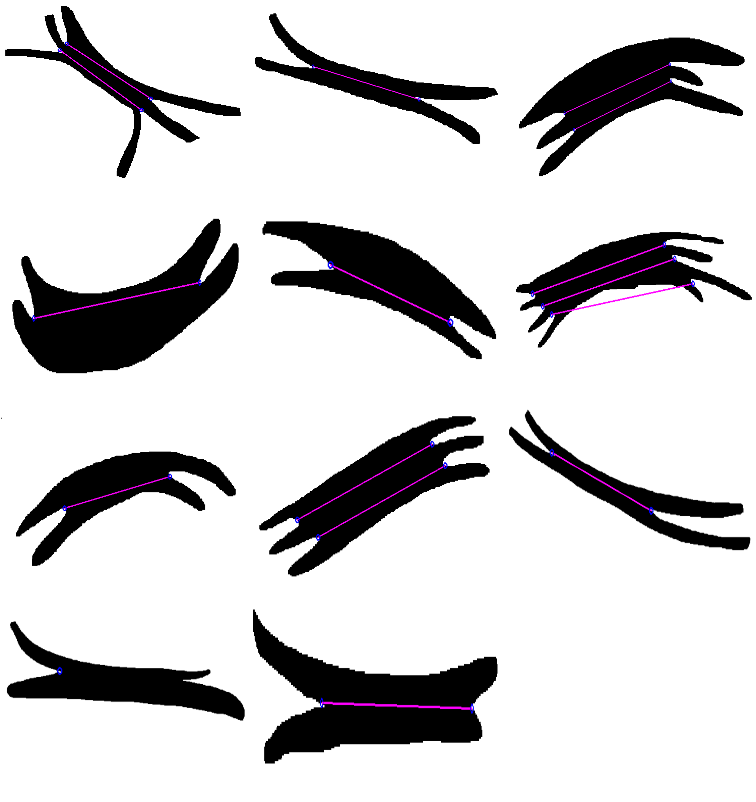

# Протяженные 2d объекты: нахождение разрезов

# Введение
Хотим научиться восстанавливать границы между объектами на картинке сегментации, так как отдельные объекты на картине 
могут "склеиваться". Задача взята из статьи, полную версию которой можно прочитать по ссылке в материалах. 

  

# Этапы работы
### Поиск точек перегиба (junction points)
Для решения данной задачи был руками сгенерирован набор тестовых данных, в которых были изображены картинки, подобные тем, 
что изображены в [статье](https://www.nature.com/articles/s41598-018-29037-x/figures/8). Затем, при помощи библиотеки 
`opencv`был выполнен следующий алгоритм:
1. Ищем границу объекта. 
2. Проходимся по границе. Допустим мы находимя в точке `P[i]`. Рассмотрим векторы `P[i - 15] P[i]` и `P[i] P[i + 15]`.
Если угол между ними будет больше некоторого условного значения (типа 120 градусов), то считаем, что данная точка 
является junction point.

  

Однако, сложность этого подхода заключается в поиске оптимальных предельных значений угла. На текущий момент имеется 
следующий результа:

  

Как видно, на текущий момент есть следующие проблемы:
1. Пока есть проблема, что выделяются даже перегибы, которые "перегибаются в обратную сторону". Проблему можно исправить,
если научиться находить нормальный вектор поверхности.

  

2. Далее есть множественные артефакты, которые должны исправится хорошо подобранными параметрами.

**UPD:** Эти проблемы по большей степени решены после добавления максимального расстояния, на которое могут буть удалены 
соседи от рассматривоемой точки.

### Построение разрезов
Для построения разрезов воспользуемся, следующим алгоритмом:
1. Для каждой точки разреза построим "касательную" (приближенно). На рисунке это `r_i l_i`. Находим точки пересечения 
этой прямой с границей объекта, выбираем самую ближнюю от рассматриваемой точки `R_i` (на рисунке `m_i`).
2. Далее, мы строим матрицу `W(i,j)` размера `N x N`, где `N` - количество точек перегиба, по следующему алгоритму. Для 
каждой пары точек перегиба введем следующую весовую функцию:
$W(i, j) = \frac{min(m_i l_i, m_j l_j)}{max(m_i l_i, m_j l_j)}$.
Эта функция позволяет определить, насколько две точки перегиба "близки" к одной и той же границе.
3. Строим наибольшее паросочетание, что сумма весов, выбранных ребер, была наибольшей. Это можно сделать с помощью 
"Алгоритма сжатия цветков" или аналога. К сожалению, пока что я не очень понимаю, как это сделать :(

  

На текущий момент сделано построение этих касательных и нахождения пересечений с границей. Однако, я не смог сделать 
"идеальный" алгоритм поиска этих точек перегиба, поэтому с написанием алгоритма могут возникнуть проблемы.

**UPD:** Сделал очень простой алгоритм, который соединяет точки, у которых точки пересечения касательных находятся ниже 
всего на картинке, затем, эти точки удаляются из всего набора, и процесс повторяется. Получается не очень хорошо, в силу
неточности поиска точек перегиба, но, тем не менее, уже имеется какой-то результат.

  

### Почти параллельная линия разреза
Для построение почти параллельной линии будем поступать следующим образом:
1. Ищем нижнюю границу объекта. Для этого пройдемся по границе и будем выбирать те вектора, которые имеют 
неотрицательную координату по x.
2. Далее воспользуемся алгоритмом из статьи для построения линии разреза.

  

  

  

После многочисленных попыток реализовать данный алгоритм, получаются крайне странные результаты. А именно, строится 
кривая, похожая на почти параллельную, но она не соединяет заданные точки :

  

Пример работы алгоритма с простыми кривыми. На этой картинке зеленые точки должны быть соединены красной линией.

# Вывод
Получилось добиться хоть какого-то построения этих разрезов, однако работа несомненно требует улучшений:
1. Необходим больший набор данных и какая-то метрика качества для оценки результатов.
2. Необходимо научиться более точно определять точки перегиба.
3. Нужно сделать более точный алгоритм построения разрезов (например, использовать тот же самый Алгоритм сжатия цветков).
4. Нужно делать разрезы "почти параллельными" границе, потому что просто проводить прямую - плохое решение, как видно на
результатах.

## Структура проекта
- `images` - все картинки.
    - `other` - картинки для вставок в `README.md`
    - `result` - результаты исполнения алгоритма для картинок из `test`
    - `resultcombo` - все результаты в одной картинке, для удобной демонстрации
    - `test` - тестовые данные
- `junctionpoints` - здесь все реализации для поиска этих самых junction points

---
## Комментарии 28.03.2024
1. Подумать про зашумление границы.
2. Сделать более реалистичные данные, которые больше похожи на те, что в статье.
3. Поправить пока что те ошибки, что имеются (не те точки выделяются и тд)

## Комментарий 25.04.2024
1. Нужно "Найти границы и от них вглубь попробовать спрятать разрезы" для построения более точных разрезов.
2. Учитывать расстояние от соседей до рассматриваемой точки, чтобы перегибы искались точнее

---

# Вопросы на будущее
1. Что является входными данными? Черно-белая маска? (Ответ: да)
2. Что является результатом решения? Черно-белая маска, у которой выделены разрезы? (Ответ: да)
3. Есть ли датасет? (Ответ: нет, нужно для начала сделать что-то руками)
4. Какая метрика качества? (Ответ: пока не понятно)

## Материалы
1. [Статья про задачу](https://www.nature.com/articles/s41598-018-29037-x/figures/8)
2. [Статья про алгоритм поиска junction points](https://ieeexplore.ieee.org/stamp/stamp.jsp?tp=&arnumber=8219709)
3. [Алгоритм сжатия цветков](https://ru.wikipedia.org/wiki/%D0%90%D0%BB%D0%B3%D0%BE%D1%80%D0%B8%D1%82%D0%BC_%D1%81%D0%B6%D0%B0%D1%82%D0%B8%D1%8F_%D1%86%D0%B2%D0%B5%D1%82%D0%BA%D0%BE%D0%B2)