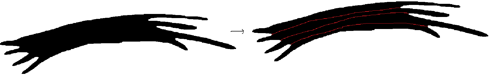

# Протяженные 2d объекты: нахождение разрезов

---
## Вопросы
1. Что является входными данными? Черно-белая маска?
2. Что является результатом решения? Черно-белая маска, у которой выделены разрезы?
3. Есть ли датасет? 
4. Какая метрика качества?
---

# Введение
Хотим научиться восстанавливать границы между объектами на картинке сегментации, так как отдельные объекты на картине 
могут "склеиваться". Задача взята из статьи, полную версию которой можно прочитать по ссылке в материалах. 

  

---
## Этапы работы
### Поиск точек перегиба (junction points)
Для решения данной задачи был руками сгенерирован набор тестовых данных, в которых были изображены картинки, подобные тем, 
что изображены в [статье](https://www.nature.com/articles/s41598-018-29037-x/figures/8). Затем, при помощи библиотеки 
`opencv`был выполнен следующий алгоритм:
1. Ищем границу объекта. 
2. Проходимся по границе. Допустим мы находимя в точке `P[i]`. Рассмотрим векторы `P[i - 15] P[i]` и `P[i] P[i + 15]`.
Если угол между ними будет больше некоторого условного значения (типа 120 градусов), то считаем, что данная точка 
является junction point.

  

Однако, сложность этого подхода заключается в поиске оптимальных предельных значений угла. На текущий момент имеется 
следующий результа:

  

Как видно, на текущий момент есть следующие проблемы:
1. Пока есть проблема, что выделяются даже перегибы, которые "перегибаются в обратную сторону". Проблему можно исправить,
если научиться находить нормальный вектор поверхности.

  

2. Далее есть множественные артефакты, которые должны исправится хорошо подобранными параметрами.

### Построение разрезов
Для построения разрезов воспользуемся, следующим алгоритмом:
1. Для каждой точки разреза построим "касательную" (приближенно). На рисунке это `r_i l_i`. Находим точки пересечения 
этой прямой с границей объекта, выбираем самую ближнюю от рассматриваемой точки `R_i` (на рисунке `m_i`).
2. Далее, мы строим матрицу `W(i,j)` размера `N x N`, где `N` - количество точек перегиба, по следующему алгоритму. Для 
каждой пары точек перегиба введем следующую весовую функцию:
$W(i, j) = \frac{min(m_i l_i, m_j l_j)}{max(m_i l_i, m_j l_j)}$.
Эта функция позволяет определить, насколько две точки перегиба "близки" к одной и той же границе.
3. Строим наибольшее паросочетание, что сумма весов, выбранных ребер, была наибольшей. Это можно сделать с помощью 
"Алгоритма сжатия цветков" или аналога. К сожалению, пока что я не очень понимаю, как это сделать :(

  

На текущий момент сделано построение этих касательных и нахождения пересечений с границей. Однако, я не смог сделать 
"идеальный" алгоритм поиска этих точек перегиба, поэтому с написанием алгоритма могут возникнуть проблемы. 

  

---
## Структура проекта
- `images` - все картинки.
    - `other` - картинки для вставок в `README.md`
    - `result` - результаты исполнения алгоритма для картинок из `test`
    - `resultcombo` - все результаты в одной картинке, для удобной демонстрации
    - `test` - тестовые данные
- `junctionpoints` - здесь все реализации для поиска этих самых junction points

---
## Комментарии 28.03.2024
1. Подумать про зашумление границы.
2. Сделать более реалистичные данные, которые больше похожи на те, что в статье.
3. Поправить пока что те ошибки, что имеются (не те точки выделяются и тд)

---
## Материалы
1. [Статья про задачу](https://www.nature.com/articles/s41598-018-29037-x/figures/8)
2. [Статья про алгоритм поиска junction points](https://ieeexplore.ieee.org/stamp/stamp.jsp?tp=&arnumber=8219709)
3. [Алгоритм сжатия цветков](https://ru.wikipedia.org/wiki/%D0%90%D0%BB%D0%B3%D0%BE%D1%80%D0%B8%D1%82%D0%BC_%D1%81%D0%B6%D0%B0%D1%82%D0%B8%D1%8F_%D1%86%D0%B2%D0%B5%D1%82%D0%BA%D0%BE%D0%B2)